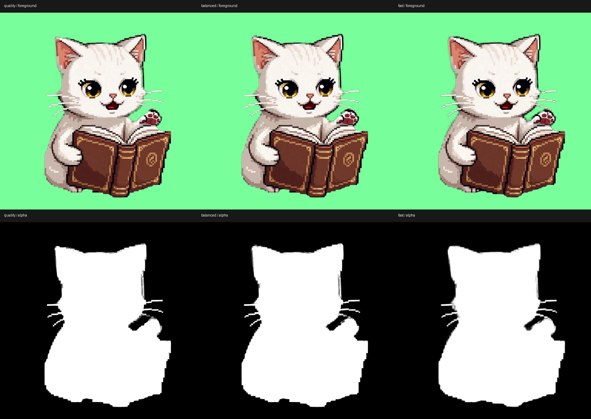
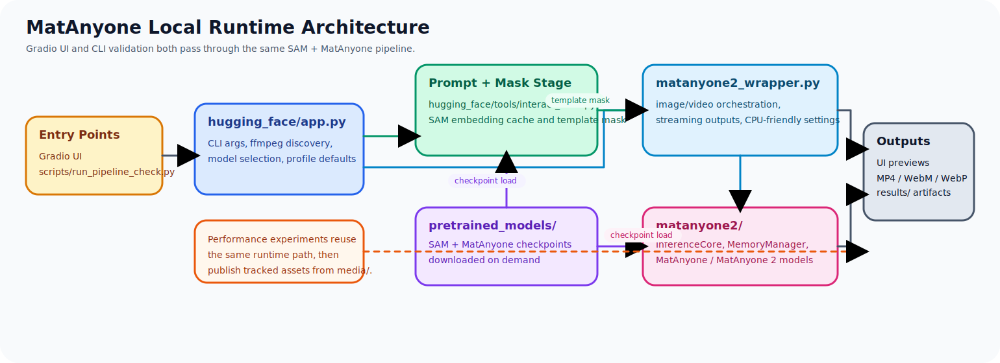

<p align="center">
  
</p>

# MatAnyone

Windows-friendly Gradio demo for `MatAnyone` and `MatAnyone 2`, adapted from the original research repositories and Hugging Face Space for local `uv`-based execution.

<p align="center">
  <a href="./README.ja.md">日本語</a> |
  <a href="https://sunwood-ai-labs.github.io/MatAnyone2-Gradio-Windows/">Docs</a> |
  <a href="https://huggingface.co/spaces/PeiqingYang/MatAnyone">Original Space</a> |
  <a href="https://github.com/pq-yang/MatAnyone2">MatAnyone 2</a> |
  <a href="https://github.com/pq-yang/MatAnyone">MatAnyone</a>
</p>

## ✨ What This Repo Is

- Packages the Gradio demo entrypoint in [`hugging_face/app.py`](./hugging_face/app.py) for local Windows use.
- Keeps both `MatAnyone` and `MatAnyone 2` checkpoints selectable from one UI.
- Adds practical local runtime behavior such as ffmpeg discovery, `uv`-friendly setup, and ignored runtime artifacts.

## 🎯 What You Can Do

| Workflow | Input | Output |
| --- | --- | --- |
| Image matting | One image plus positive/negative clicks | Foreground preview and alpha preview |
| Video matting | One video plus mask clicks on the start frame | Foreground MP4 and alpha MP4 in `results/` |
| Model comparison | Toggle between `MatAnyone` and `MatAnyone 2` | Quickly compare checkpoint behavior from the same interface |

On first launch, the app downloads the required runtime assets automatically:

- `sam_vit_h_4b8939.pth`
- `matanyone.pth`
- `matanyone2.pth`
- sample media under `hugging_face/test_sample/`

Downloaded checkpoints are stored in `pretrained_models/`, which stays out of git by design.

## 🧰 Requirements

- Windows 10 or Windows 11
- Python 3.10
- `uv`
- `git`
- `ffmpeg`
- NVIDIA GPU recommended for practical speed; CPU mode also works but is much slower

Install the base tools with `winget`:

```powershell
winget install astral-sh.uv
winget install Git.Git
winget install Gyan.FFmpeg
```

## 🚀 Quick Start

Create the virtual environment and install dependencies from the repository root:

```powershell
uv venv --python 3.10
uv pip install --python .\.venv\Scripts\python.exe --upgrade pip setuptools wheel
uv pip install --python .\.venv\Scripts\python.exe torch torchvision torchaudio --index-url https://download.pytorch.org/whl/cu124
uv pip install --python .\.venv\Scripts\python.exe -r requirements.txt
```

Launch the Gradio app with GPU acceleration:

```powershell
uv run --python .\.venv\Scripts\python.exe python hugging_face\app.py --device cuda --port 7860 --server_name 127.0.0.1
```

Launch the app in CPU mode:

```powershell
uv run --python .\.venv\Scripts\python.exe python hugging_face\app.py --device cpu --port 7860 --server_name 127.0.0.1
```

For smoother CPU inference, start with the fast profile and an explicit thread budget:

```powershell
uv run --python .\.venv\Scripts\python.exe python hugging_face\app.py --device cpu --performance_profile fast --cpu_threads 8 --sam_model_type vit_b --port 7860 --server_name 127.0.0.1
```

Then open `http://127.0.0.1:7860`.

Useful variants:

```powershell
uv run --python .\.venv\Scripts\python.exe python hugging_face\app.py --device cuda --port 7861 --server_name 127.0.0.1
uv run --python .\.venv\Scripts\python.exe python hugging_face\app.py --device cpu --performance_profile fast --port 7860 --server_name 127.0.0.1
uv run --python .\.venv\Scripts\python.exe python hugging_face\app.py --help
```

`--performance_profile auto` resolves to `fast` on CPU and `quality` on GPU. `--sam_model_type auto` also picks `vit_b` on CPU and `vit_h` on GPU. You can switch both from the CLI before launch.

## CLI Validation

The Gradio app and the CLI now share the same runtime core under [`matanyone2/demo_core.py`](./matanyone2/demo_core.py). For faster verification during development, you can run the same pipeline without launching the web UI:

```powershell
uv run --python .\.venv\Scripts\python.exe python -m matanyone2.cli --input .\media\bookcat.mp4 --device cuda --model "MatAnyone 2" --positive_point center --output_dir .\results\cli
```

The legacy validation script is now just a thin wrapper around the same shared CLI:

```powershell
uv run --python .\.venv\Scripts\python.exe python .\scripts\run_pipeline_check.py --input .\media\bookcat.mp4 --device cpu --performance_profile fast --positive_point center
```

Every run now creates a folder like `results/<input-name>_<timestamp>/` and writes both final outputs and debug artifacts there, including the selected input frame, SAM preview/mask, first and last matting frames, and a `metadata.json` snapshot of the run configuration.

To reproduce the historical `bookcat-profile-exp` benchmark outputs more closely, pin the same prompt points and video/output FPS explicitly:

```powershell
uv run --python .\.venv\Scripts\python.exe python -m matanyone2.cli --input .\media\bookcat.mp4 --device cpu --performance_profile fast --cpu_threads 8 --sam_model_type vit_h --frame_limit 241 --video_target_fps 0 --output_fps 12 --positive_point 280,180 --negative_point 30,30 --negative_point 530,30 --model "MatAnyone 2" --output_dir .\results
```

## 📚 Documentation

Structured docs now live under the published site at [sunwood-ai-labs.github.io/MatAnyone2-Gradio-Windows](https://sunwood-ai-labs.github.io/MatAnyone2-Gradio-Windows/) and in the source tree under [`docs/`](./docs/index.md).

- Getting started: [`docs/guide/getting-started.md`](./docs/guide/getting-started.md)
- Usage guide: [`docs/guide/usage.md`](./docs/guide/usage.md)
- Performance notes: [`docs/guide/performance.md`](./docs/guide/performance.md)
- Architecture notes: [`docs/guide/architecture.md`](./docs/guide/architecture.md)
- Troubleshooting: [`docs/guide/troubleshooting.md`](./docs/guide/troubleshooting.md)

To preview the docs site locally:

```powershell
cd docs
npm install
npm run docs:dev
```

## Performance Snapshot

We measured the full `SAM -> MatAnyone -> output video` pipeline on [`media/bookcat.mp4`](./media/bookcat.mp4) with the local validation script [`scripts/run_pipeline_check.py`](./scripts/run_pipeline_check.py).

| Profile | CPU time | GPU time | GPU speedup vs CPU |
| --- | ---: | ---: | ---: |
| `quality` | `227.76s` | `72.84s` | `3.13x` |
| `balanced` | `225.62s` | `78.72s` | `2.87x` |
| `fast` | `211.33s` | `71.43s` | `2.96x` |

The generated comparison report lives in `results/bookcat-profile-exp-compare.json`, and a representative frame comparison lives in `results/bookcat-profile-exp/comparison_frame_120.png`. See [`docs/guide/performance.md`](./docs/guide/performance.md) for experiment settings and quality deltas against `quality`.

<p align="center">
  
</p>

Compact animated previews are also available as half-resolution WebP files generated from the MatAnyone foreground+alpha pairs.

| `quality` | `balanced` | `fast` |
| --- | --- | --- |
|  |  |  |

## 🧭 Runtime Architecture

The runtime shape of the local app is documented as a tracked `draw.io` source plus an exported SVG.

- Source: [`media/matanyone-architecture.drawio`](./media/matanyone-architecture.drawio)
- SVG: [`media/matanyone-architecture.svg`](./media/matanyone-architecture.svg)

<p align="center">
  
</p>

The current implementation uses a shared runtime core in [`matanyone2/demo_core.py`](./matanyone2/demo_core.py) so that the Gradio app and the CLI follow the same processing path. The thin entrypoints are:

- [`hugging_face/app.py`](./hugging_face/app.py) for the Gradio UI
- [`matanyone2/cli.py`](./matanyone2/cli.py) for direct CLI execution
- [`scripts/run_pipeline_check.py`](./scripts/run_pipeline_check.py) as a compatibility wrapper around the CLI

## 🖱️ Using the UI

1. Open the `Video` or `Image` tab.
2. Load your input file.
3. Click positive and negative points to define the target.
4. Press `Add Mask` once the current object selection looks right.
5. Run `Video Matting` or `Image Matting`.
6. Collect rendered outputs from `results/`.

Each run now writes to its own folder, for example `results/bookcat_1773163828_6577592/`. That folder includes:

- final outputs such as `*_foreground.mp4`, `*_alpha.mp4`, `*_mask.png`, and `*_sam_preview.png`
- debug artifacts such as `input_first_frame.png`, `input_selected_frame.png`, `sam_selected_preview.png`, `sam_selected_mask.png`, `matting_output_first_*`, and `matting_output_last_*`
- `metadata.json` with the exact runtime settings used for the run

## 🗂️ Repository Layout

| Path | Purpose |
| --- | --- |
| `hugging_face/app.py` | Gradio app entrypoint and local runtime glue |
| `hugging_face/tools/` | UI helper utilities used by the demo |
| `matanyone2/demo_core.py` | Shared runtime used by both Gradio and CLI |
| `matanyone2/cli.py` | Direct CLI entrypoint for validation and reproducible runs |
| `matanyone2/` | Upstream model and inference code |
| `pretrained_models/` | Auto-downloaded checkpoints, ignored by git |
| `results/` | Generated video outputs, ignored by git |
| `media/` | Repository branding assets used in the README |

## 🛠️ Troubleshooting

- If ffmpeg is not detected, confirm `ffmpeg.exe` is on `PATH` or installed via `winget`. The app also scans common Winget install directories automatically.
- If CUDA launch fails, install a matching PyTorch build for your driver or switch to `--device cpu`.
- If the first launch takes a while, that is expected because checkpoints and sample media are downloaded on demand.
- If you want a different port or bind address, use `--port` and `--server_name`.

## 🙏 Attribution And License

This repository is a derivative adaptation of the following upstream projects:

- [MatAnyone2](https://github.com/pq-yang/MatAnyone2)
- [MatAnyone](https://github.com/pq-yang/MatAnyone)
- [Original Hugging Face demo](https://huggingface.co/spaces/PeiqingYang/MatAnyone)

The included [`LICENSE`](./LICENSE) is the upstream `S-Lab License 1.0`. Commercial use still requires permission from the original authors listed in that license file.
